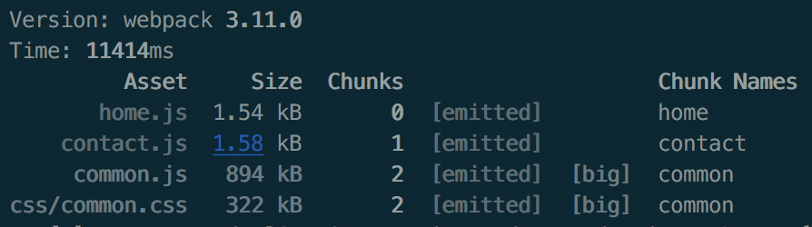

Webpack
=======

#¿Qué podemos hacer con Webpack?

Qué es Webpack, para qué sirve y por qué deberías tomar este curso.

**WP** es un Module Bundler for Modern JS Applications, es decir un empaquetador de módulos para el desarrollo de aplicaciones modernas en JavaScript.

**¿Por qué usar Webpack?**

* Aunque hay otras alternativas **WP** es un la forma mas sofisticada para cargar y transformar módulos. WP trae todas las formas de importación de módulos, en resumen trae lo mejor de todos los mundos.

* **Entrypoints** - múltiples puntos de entrada a tus aplicaciones - archivos iniciales, tienes uno por cada pagina que vayas a usar.

* Puedes tener multiples entrypoints.

* **OUTPUT**. Si bien le decimos cual es el archivo fuente, debemos decirle que hacer con eso y donde ponerlo, porque no queremos mezclar los archivos finales que lee el navegador con los archivos fuente.

* **Loaders**. Nos ayudan a cargar todo tipo de formato de archivos. Ej: coffescript, jsx,

* **Plugins**. nos ayudan a extender las caracteristicas de WP, por ejemplo comprimir archivos, dividir nuestros modulos en chunks, etc.

>> **WP** es developer experience.

## Instalación

```bash
npm init
```

```bash
npm install webpack --save-dev
```

```bash
npm list webpack
```

## Creando el primer bundle

Ya con Webpack instalado, vamos a crear nuestro primer bundle, y para esto necesitamos tener un entrypoint.
En este vídeo vamos a ver el paso a paso de cómo obtenerlo.

```bash
webpack index.js bundle.js
```
 Deberemos colcar este comando en el package.json como uno de los scripts y luego corremos la tarea:

```bash
npm run build
```

## Creando un webpack.config

* En esta parte del curso vamos a extender un poco más la configuración de WP.
* También vamos a crear un nuevo archivo llamado webpack.config.js.
* En este nuevo archivo que acabamos de crear vamos a definir el entry y el output de la aplicación.

# Creando estilos

Usamos los loaders css-loader y style-loader.

# Plugins

Para poner los archivos de css como un archivo externo, necesitamos usar un pluigin llamado extract-text-webpack-plugin.

# Iniciando un servidor de desarrollo - Webpack DevServer

https://webpack.js.org/configuration/dev-server/
https://github.com/webpack/webpack-dev-server

# Soporte ECMA script
Vamos a utilizar un nuevo loader; Babel-loader

https://github.com/babel/babel-loader

# Clase 14 - Soporte de imágenes en Webpack

https://github.com/webpack-contrib/url-loader

# Soporte de fuentes en webpack

https://www.fontsquirrel.com/

# Estilos con SASS

[SASS LOADER](https://github.com/webpack-contrib/sass-loader)

npm -i sass-loader

# Clase 20 - Estilos con Stylus

```bash
$ npm run build:stylus -- --watch
```

[Stylus Loader](https://github.com/shama/stylus-loader)

# Clase 21 - Estilos con less

[LESS Loader]https://github.com/webpack-contrib/less-loader

# Clase 22 - Estilos con PostCSS

Configuras el procesador como módulos. Estos módulos deben ser instalados.

```bash
$ npm run build:postcss -- --watch
```

[PostCSS Loader](https://github.com/postcss/postcss-loader)

# Clase 24 - Prevenir código duplicado



# Clase 25 - Eligiendo dependencias comunes

Ya que vimos como empaquetar nuestras dependencias comunes y código que se repite. Ahora veamos como podemos tomar la decisión de qué archivos poner como dependencia común a todo el proyecto.

```bash
$ npm run build:vendor
```

# Clase 26 - Optimizando el paquete de dependencias comunes

Por medio de estas librerías podemos evitar compilar las dependnecias comunes ya que estas no van a cambiar a menos que se cambie la versión.

Vamos a necesitar dos archivos de configuración.

```bash
$ npm run build:ddl
```

# Clase 27 - Enlazando un Dynamic Link Library

```bash
$ npm run build:dll:src
```

# Clase 28 - Cargando módulos asincronamente

Es una herramienta muy útil debido al tamaño de los paquetes. Por medio de esta tool podrás descargar un módulo cuando realmente la necesites en algún evento que invoques.


```bash
$ npm run build:dynamic
```

Para usar la sintaxis de importación asíncrona, deberemos usar otro plugin de Babel; [babel-plugin-syntax-dynamic-import](https://babeljs.io/docs/en/babel-plugin-syntax-dynamic-import/).

Se ha creado un módulo '0.js':

          Asset       Size  Chunks                    Chunk Names
           0.js  267 bytes       0  [emitted]
        home.js     145 kB       1  [emitted]         home
     contact.js     141 kB       2  [emitted]         contact
   css/home.css     322 kB       1  [emitted]  [big]  home
css/contact.css     322 kB       2  [emitted]  [big]  contact

que contiene nuestro módulo alerta.

# Clase 29 - Llevando un proyecto real a Webpack - preparación del entorno

Podemos empezar un proyecto prefabricado con React por medio de esta librería de npm: [create-react-app](https://www.npmjs.com/package/create-react-app). Igualmente, nosotros usaremos un proyecto hecho en otro curso que lo obtuvimos del siguiente link `https://github.com/LeonidasEsteban/invie-animated`.

(Clase 30 fue un video que no suma nada).

# Clase 31 - Llevando un proyecto real a Webpack - configuración para entornos de desarrollo

```bash
$ npm install -D babel-core babel-loader babel-preset-es2015 babel-preset-react style-loader css-loader url-loader file-loader webpack webpack-dev-server

$ npm install babel-preset-stage-2

```

# Clase 32 -Configuración para entornos de producción


